# Fedora 34 Installation Checklist

## Pre Install
Backup your data, don't forget the following:
* SSH configuration and keys (`~/.ssh/`)
* Remmina configurations (`~/.local/share/remmina`)

## Installation
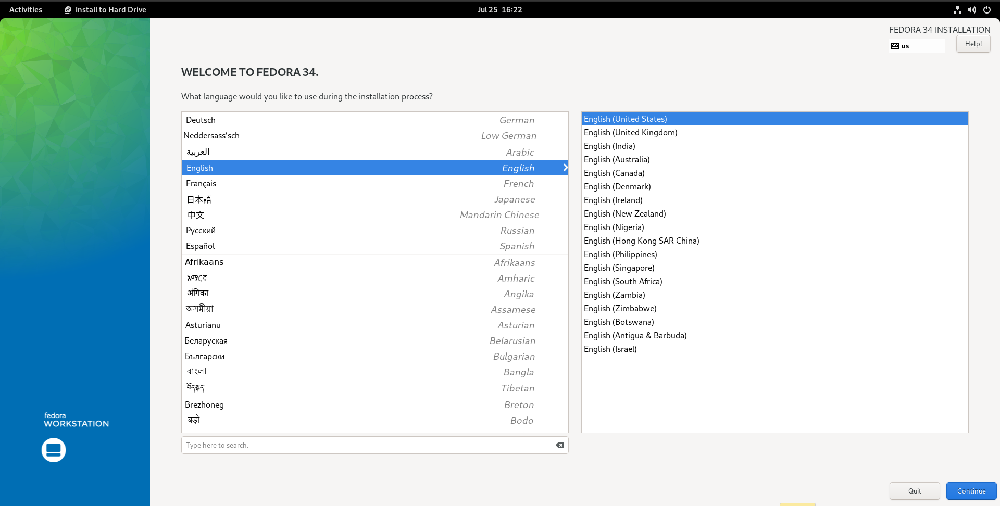  
  
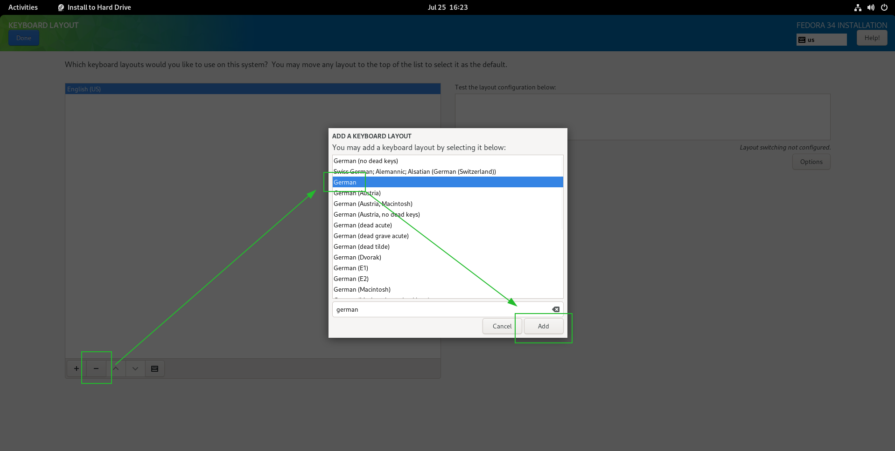  

You can configure the storage automaticly, or using the "Advanced Custom" mode, using the blivet gui.  
If you encrypt your data, make sure to check whether the correct keyboard layout has been selected before setting the passphrase for the disk encryption.  
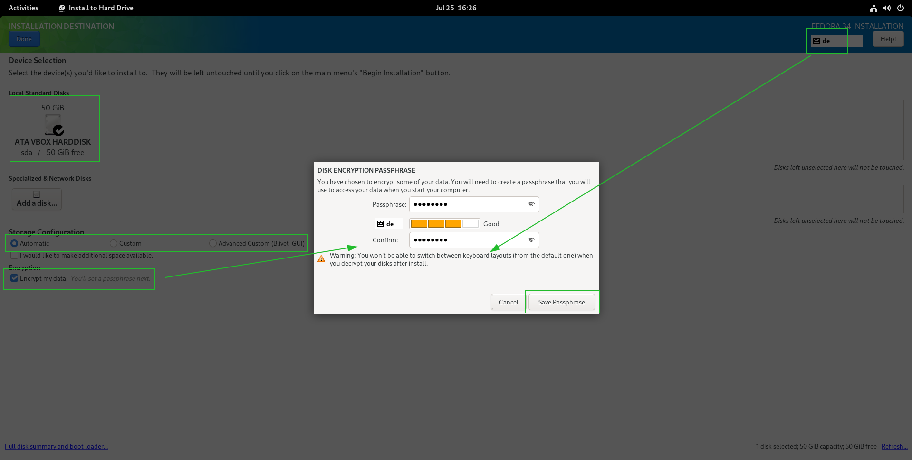  

You can start the installation now:  
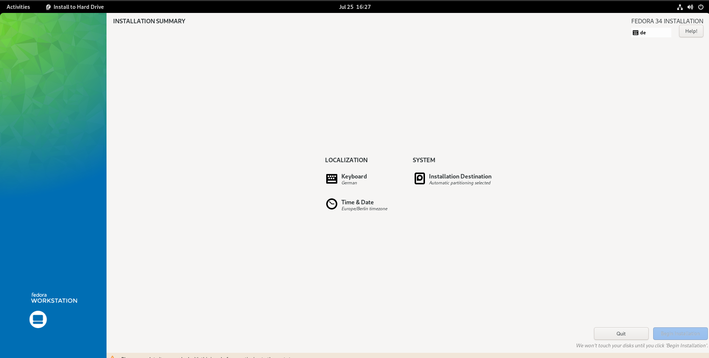  

Finally you can restart your computer.

## Post Install
Adjust the configuration section in the [`fedora.sh`](./fedora.sh) script and execute it. Afterwards logout and login again with Cinnamon as desktion environment (right bottom cornor -> cog icon). 

I personally like to change a few settings in the file explorer **Nemo (Edit/Preferences)**.  
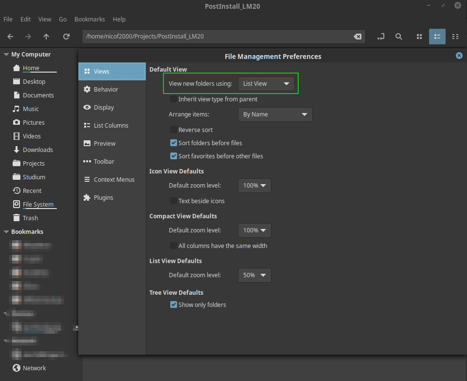

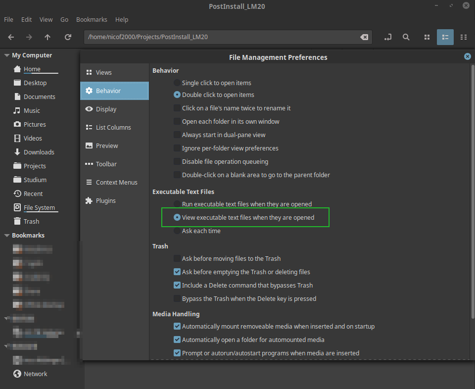

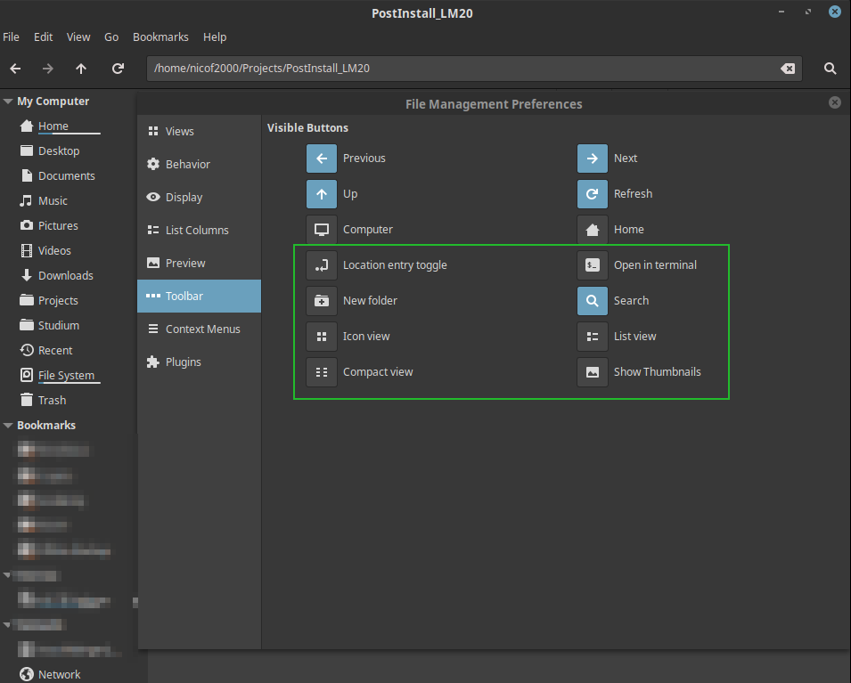

Press CTRL + L one time to make the URL bar editable.

Make sure your **Date and Time** settings work for you. By default the first day of the week is sunday and the date won't be displayed in the calendar applet.  
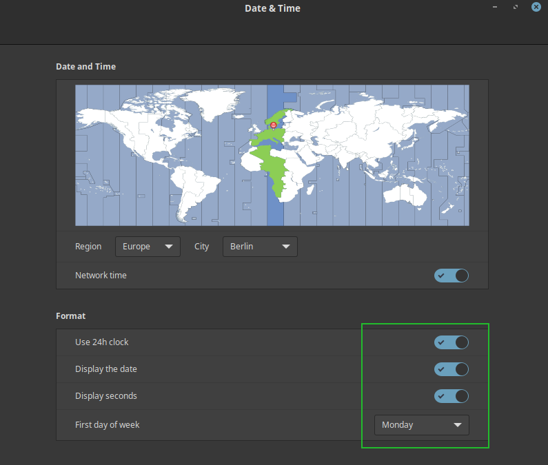

If you are on a notebook make sure to change the **Mouse and Touchpad** settings. (e.g. horiziontal or vertical scrolling)

I like to have a clean desktop, so I only add the trash bin.
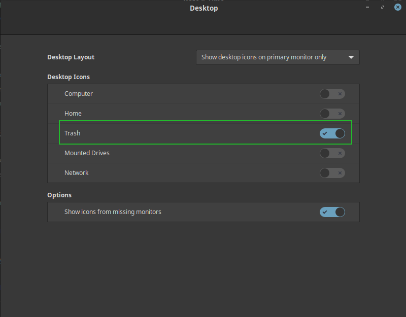

I also like to see some system stats in my panel, so I always install the applet: CPU Temperatur Indicator
Also I like to add QRedshift for manual blue light filtering.  
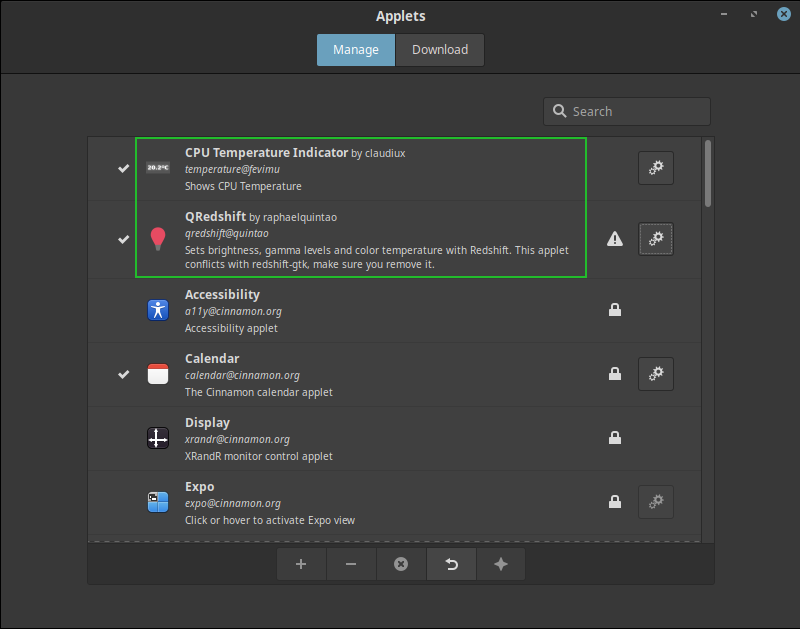  
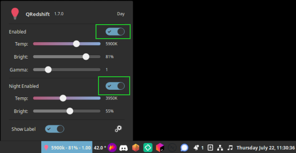

As you probably noticed the system made some noice when logging in. I don't like those so I disable all system sounds.
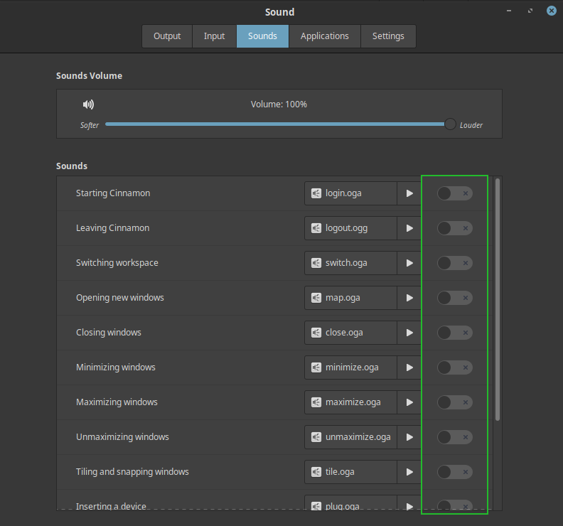

After I added my printers, configured my preferred and startup applications.

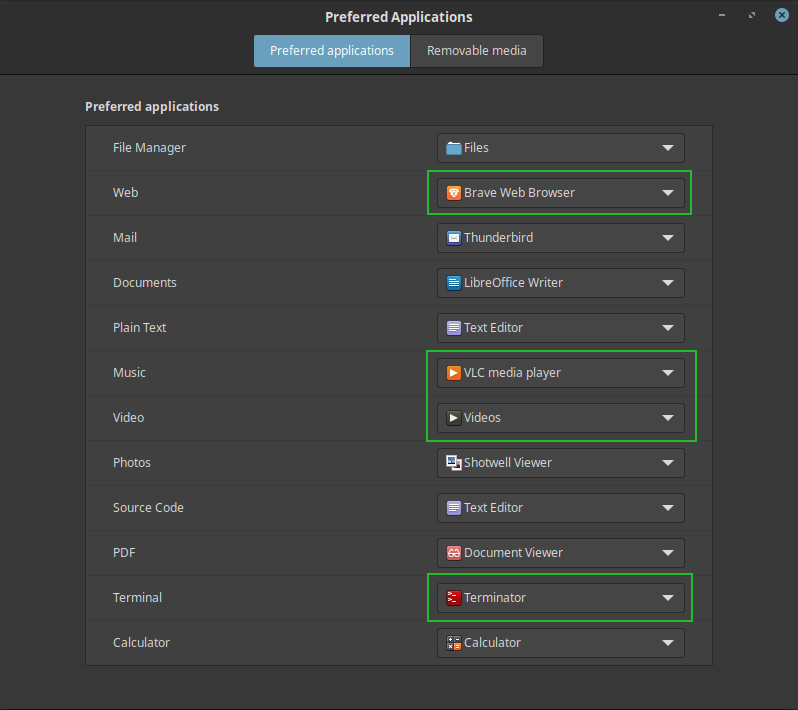

## TODO
- SELinux Cinnamon adjustments
  ```shell
  ausearch -c 'gnome-session-c' --raw | audit2allow -M my-gnomesessionc
  semodule -X 300 -i my-gnomesessionc.pp
  ```
- Install JetBrains Toolbox
