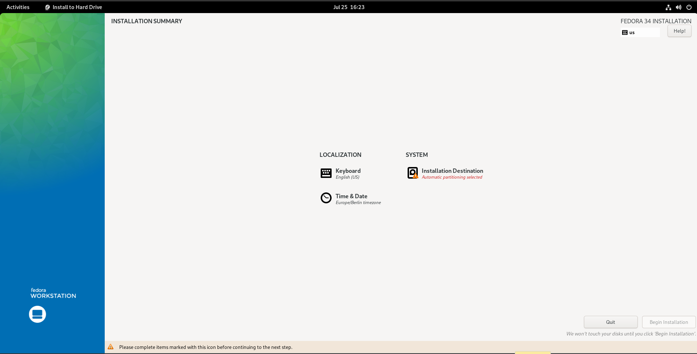

# Fedora 37 Installation Checklist

## Pre Install
Backup your data, don't forget the following:
* SSH configuration and keys (`~/.ssh/`)
* Remmina configurations (`~/.local/share/remmina`)
* GPG keys (`~/.gnupg`)
* Wireguard configurations (`/etc/wireguard/*.conf`)

## Installation
  
  
  

  

Select "Encrypt Data" and create the partitions automaticly with btrfs as filesystem. 
  

Make sure to change the btrfs volume names as described in the following two pictures to match ubuntu btrfs naming schemas (which is required for timeshift to work).
  
  

> Warning: The us american keyboard layout is still active in live system!

  
  

You can start the installation now:  
  

Finally you can restart your computer.

On the first start you will be prompted with a dialog where you can create a user account, also you should enable the Third Party Repositories.

## Post Install
Adjust the configuration section in the [`fedora.sh`](./fedora.sh) script and execute it.

### File Manager: nemo
I personally like to change a few settings in the file explorer **Nemo (Edit/Preferences)**.  

Press CTRL + L one time to make the URL bar editable.

### Text-Editor: xed

### Other
* Adjust Startup Applications (--start-in-tray / --hidden flags) to start in tray
